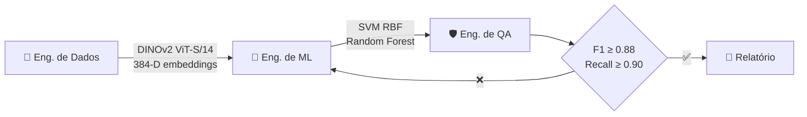

<!-- ══════════════════════════════════════════════════════════════════ -->
<!--              G A B R I E L   S E N A  ·  G I T H U B              -->
<!-- ══════════════════════════════════════════════════════════════════ -->

<div align="center">


<br/>

<!-- ═══════════ TYPING SVG ═══════════ -->

<a href="https://git.io/typing-svg">
  
</a>

<br/><br/>

<!-- ═══════════ IDENTITY BADGES ═══════════ -->

[](https://www.ufcg.edu.br/)&nbsp;&nbsp;
[](https://embrapii.org.br/)&nbsp;&nbsp;
[](#)

<br/>


</div>

<br/>

<!-- ══════════════════════════════════════════════════════════════════ -->
<!--                          SOBRE MIM                                -->
<!-- ══════════════════════════════════════════════════════════════════ -->

## &nbsp; Sobre Mim

```python
class GabrielSena:
    """Engenheiro que enxerga defeitos antes que eles aconteçam."""

    education  = "Engenharia Elétrica — UFCG"
    research   = "P&D Visão Computacional — Embrapii / PaqTcPB"
    hpc        = "Supercomputador Corisco — treinamento de modelos em escala"
    philosophy = "Yetser HaTov — código intencional, limpo por princípio"

    focus = [
        "Predictive Maintenance via Thermography",
        "Vision Transformers · DINOv2 · ViT",
        "High-Voltage Systems · NBR 15866 · IEC 60076-7",
        "MLOps with Autonomous AI Agents",
        "Clean Code · SOLID · F.I.R.S.T.",
    ]
```

Minha trajetória começou nos circuitos e sistemas da Engenharia Elétrica na **UFCG**. Lá aprendi algo fundamental: **todo problema complexo tem estrutura matemática**. Essa base me levou para **Machine Learning e Visão Computacional**, onde utilizo o supercomputador **Corisco** para treinar **Vision Transformers (DINOv2)** aplicados à **termografia preditiva de ativos elétricos de alta tensão**.

Hoje construo a ponte entre normas técnicas (NBR 15866, IEC 60076-7) e modelos de visão computacional que **preveem falhas antes que aconteçam**.

---

<!-- ══════════════════════════════════════════════════════════════════ -->
<!--                          PROJETOS                                 -->
<!-- ══════════════════════════════════════════════════════════════════ -->

## &nbsp; Projetos

<br/>

<!-- ── 01 · PYRON ───────────────────────────────────────────────── -->

> ### 🔥 &nbsp;[Pyron — Manutenção Preditiva por Termografia](https://github.com/gabrielsena87/Pyron---Embrapii)
>
> Software industrial para diagnóstico preditivo de **transformadores de potência** e **subestações** de alta tensão.
>
> `PyTorch` `ONNX` `FastAPI` `OpenCV` `FLIR` `ReportLab` `C#`

<details>
<summary>&nbsp;&nbsp;&nbsp;&nbsp;→ ver detalhes</summary>

<br/>

| Camada | Tecnologias |
|:-------|:------------|
| ML & Visão | PyTorch · ONNX Runtime · RapidOCR · OpenCV · DINOv2 |
| Back-end | FastAPI · Uvicorn · HTTPX |
| Front-end | Edge App Mode · HTML5 · CSS3 Modular · Vanilla JS |
| Desktop | C# nativo compilado — zero dependências externas |
| Relatórios | ReportLab — laudos periciais em PDF (padrão ART) |

**Destaques:**
- Ingestão radiométrica FLIR + algoritmo de inversão de paleta de cores
- Motor normativo duplo — **ABNT NBR 15866** (MTA Projetada) + **NETA** (ΔT entre fases)
- Gêmeo físico — envelhecimento de isolamento via Arrhenius (IEC 60076-7 / IEEE C57.91)
- Geração automática de laudos periciais em PDF
- Detectores ONNX treinados com anotações CVAT

</details>

<br/>

<!-- ── 02 · THERMAL IMAGE CLASSIFICATION ────────────────────────── -->

> ### ⚡ &nbsp;[Predição Industrial com Imagens Térmicas](https://github.com/gabrielsena87/modelo-de-predicao-industrial-com-imagens-termicas)
>
> **DINOv2 ViT-B/14** para classificação de 5 classes de equipamentos de subestação — **98.52%** de acurácia em teste cego, com auditoria contra overfitting e burst effect.
>
> `DINOv2` `PyTorch` `Scikit-Learn` `t-SNE` `Stratified K-Fold`

<details>
<summary>&nbsp;&nbsp;&nbsp;&nbsp;→ ver detalhes</summary>

<br/>

| Métrica | Resultado |
|:--------|:----------|
| Acurácia Hold-out (135 imagens) | **98.52%** |
| Acurácia 5-Fold CV (893 imagens) | **99.44% ± 0.50%** |
| F1-Score Ponderado | **0.9944** |
| Backbone | Meta AI DINOv2 ViT-B/14 — 768-D |
| Classificadores | Logistic Regression · SVM RBF · Random Forest |

**893 imagens reais** de 5 classes críticas: disjuntores · seccionadoras · transformadores de potência · para-raios · bobinas de bloqueio.

**Destaques:**
- Mitigação do burst effect (fotos em rajada com fundos idênticos)
- Localizador geométrico de hotspots — coordenadas, área e bounding box
- Motor normativo NBR 15572 / NFPA 70B
- Testes F.I.R.S.T. · Dataclasses imutáveis · Módulos < 150 linhas

</details>

<br/>

<!-- ── 03 · HYBRID PIPELINE ────────────────────────────────────── -->

> ### 🧠 &nbsp;[Thermal Vision AI — DINOv2 + SIFT](https://github.com/gabrielsena87/projetos)
>
> Pipeline de **ensemble stacking** que combina deep features (DINOv2 768-D) com descritores geométricos (SIFT 128-D) → vetor híbrido de **896 dimensões** — **99.10%** de acurácia.
>
> `DINOv2` `SIFT` `StackingClassifier` `PCA` `Fine-Tuning`

<details>
<summary>&nbsp;&nbsp;&nbsp;&nbsp;→ ver detalhes</summary>

<br/>

```
DINOv2 ViT-B/14 (768-D)  +  SIFT (128-D)
              │                    │
              └──────┬─────────────┘
                     ▼
        StandardScaler → VarianceThreshold → SelectKBest → PCA
                     │
                     ▼
              StackingClassifier
         ┌──────┼──────────┐
        KNN    RF       SVM RBF
              └──┬──┘
          Logistic Regression
              (meta-learner)
```

| Métrica | Resultado |
|:--------|:----------|
| Acurácia 5-Fold CV | **99.10%** |
| Cohen's Kappa | **0.9887** |
| Macro F1 | **0.9910** |

Fine-tuning supervisionado de ViT · Dashboard HTML automático · CLI de inferência

</details>

<br/>

<!-- ── 04 · MOJO REALTIME ──────────────────────────────────────── -->

> ### 🏎️ &nbsp;ViT Termovision — Tempo Real com Mojo
>
> Inferência de **ultra-alta performance** usando **Mojo** e **Modular MAX Runtime** para classificação em tempo real de **motores de indução** e **transformadores secos** (dataset BNUT — 795 imagens).
>
> `Mojo` `MAX Runtime` `DINOv2` `ViT-B/16` `CLAHE` `SHA-256`

<details>
<summary>&nbsp;&nbsp;&nbsp;&nbsp;→ ver detalhes</summary>

<br/>

| Equipamento | Imagens | Falhas |
|:------------|:--------|:-------|
| Transformador Seco | 346 | 8 níveis de curto entre espiras + 90 GT masks |
| Motor de Indução 3φ | 449 | Curto estatórico · Ventilador · Rotor bloqueado |

- Pipeline Mojo compilado nativamente para inferência em borda
- Processamento multivariante: raw · CLAHE · letterbox 224×224
- Auditoria de integridade via checksums SHA-256
- Streaming de vídeo com análise de estabilidade temporal

</details>

<br/>

<!-- ── 05 · MLOPS ORCHESTRATOR ─────────────────────────────────── -->

> ### 🤖 &nbsp;Orquestrador MLOps Multiagente
>
> Framework de **agentes de IA autônomos** (Gemini + Antigravity SDK) para treinamento, validação e QA de modelos — detecção de falhas em **isoladores** e **conectores** de subestação.
>
> `Asyncio` `Gemini API` `Antigravity SDK` `DINOv2 ViT-S/14`

<details>
<summary>&nbsp;&nbsp;&nbsp;&nbsp;→ ver detalhes</summary>

<br/>



**QA com tolerância zero para falsos negativos em rede elétrica crítica:**
- F1 ≥ 0.88 · Recall `flashover` ≥ 0.90 · Recall `superaquecimento` ≥ 0.90
- Loop fechado de feedback com reajuste automático de hiperparâmetros
- Backoff exponencial com jitter para resiliência de rede

</details>

<br/>

---

<!-- ══════════════════════════════════════════════════════════════════ -->
<!--                           STACK                                   -->
<!-- ══════════════════════════════════════════════════════════════════ -->

## &nbsp; Stack

<div align="center">

<table>
<tr>
<td align="center" width="33%">

**ML & Visão**


</td>
<td align="center" width="33%">

**Linguagens**


</td>
<td align="center" width="33%">

**Infra & Tools**


</td>
</tr>
</table>

</div>

---

<!-- ══════════════════════════════════════════════════════════════════ -->
<!--                        CLEAN CODE                                 -->
<!-- ══════════════════════════════════════════════════════════════════ -->

## &nbsp; Clean Code — Yetser HaTov

<table>
<tr>
<td width="50%" valign="top">

```
PRINCÍPIOS
──────────
▸ Proporção 10:1 — clareza primeiro
▸ Lei de LeBlanc — "later = never"
▸ Regra do Escoteiro — sempre melhor
▸ SRP — uma função, um propósito
▸ CQS — comando ou consulta
▸ Zero flags booleanas
```

</td>
<td width="50%" valign="top">

```
QUALIDADE
─────────
▸ S.O.L.I.D. em toda classe
▸ F.I.R.S.T. em todo teste
▸ Dataclasses imutáveis (frozen)
▸ Módulos < 150 linhas
▸ Zero números mágicos
▸ Exceções isoladas, nunca None
```

</td>
</tr>
</table>

---

<!-- ══════════════════════════════════════════════════════════════════ -->
<!--                         NORMAS                                    -->
<!-- ══════════════════════════════════════════════════════════════════ -->

## &nbsp; Normas Técnicas

<div align="center">

| Norma | Escopo |
|:------|:-------|
| ABNT NBR 15866 | Máxima Temperatura Admissível — MTA |
| ABNT NBR 15572 | Severidade por ΔT em subestações |
| NETA | ΔT entre fases semelhantes |
| NFPA 70B | Manutenção preventiva elétrica |
| IEC 60076-7 | Envelhecimento térmico de transformadores |
| IEEE C57.91 | Carregamento de transformadores |

</div>

---

<!-- ══════════════════════════════════════════════════════════════════ -->
<!--                          STATS                                    -->
<!-- ══════════════════════════════════════════════════════════════════ -->

## &nbsp; GitHub

<div align="center">


&nbsp;


</div>

---

<!-- ══════════════════════════════════════════════════════════════════ -->
<!--                         CONTATO                                   -->
<!-- ══════════════════════════════════════════════════════════════════ -->

<div align="center">

[](mailto:gabriel.vieira.eletrica@gmail.com)&nbsp;&nbsp;
[](https://github.com/gabrielsena87)&nbsp;&nbsp;
[](https://linkedin.com/in/gabrielsena87)

<br/><br/>

<sub><i>"O código limpo faz uma coisa bem feita."</i> — Bjarne Stroustrup</sub>

</div>
