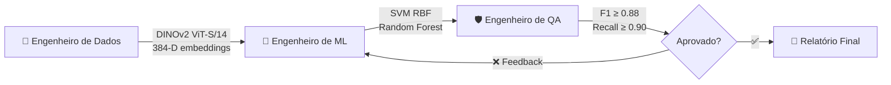

<div align="center">

<!-- ════════════════════ TAGLINE ANIMADA ════════════════════ -->

<a href="https://git.io/typing-svg">
  
</a>

<br/>

<!-- ════════════════════ BADGES DE IDENTIDADE ════════════════════ -->

[](https://www.ufcg.edu.br/)
[](https://embrapii.org.br/)
[](#)

<br/>

[](https://linkedin.com/in/gabrielsena87)
[](mailto:gabriel.vieira.eletrica@gmail.com)
[](https://github.com/gabrielsena87)


</div>

---

## 🧭 Sobre Mim

```python
class GabrielSena:
    """Engenheiro que enxerga defeitos antes que eles aconteçam."""

    role       = "Bolsista de Pesquisa Industrial — Visão Computacional"
    education  = "Engenharia Elétrica @ UFCG (2025–2029)"
    lab        = "Embrapii P&D / PaqTcPB — Supercomputador Corisco"
    philosophy = "Yetser HaTov — Código intencional, limpo por princípio"

    expertise  = [
        "Predictive Maintenance via Thermography",
        "Vision Transformers (DINOv2 · ViT)",
        "High-Voltage Electrical Systems (NBR 15866 · IEC 60076-7)",
        "MLOps with Autonomous AI Agents",
        "Clean Code · SOLID · F.I.R.S.T. Testing",
    ]
```

Minha trajetória começou nos circuitos e sistemas da Engenharia Elétrica na **UFCG** — uma das maiores escolas de engenharia do Nordeste. Lá aprendi algo fundamental: **todo problema complexo tem estrutura matemática**. Acredito que a eficiência de um modelo nasce na qualidade da sua estrutura matemática. Com background em Cálculo e Probabilidade, foco em resolver desafios de dados com o rigor técnico da engenharia.

Essa base me levou naturalmente para **Machine Learning e Visão Computacional**. No **PIBIC**, processei dados experimentais de **Gramíneas**, lidando com ruído, inconsistências e prazos reais — o ambiente perfeito para desenvolver resiliência técnica. Na **Embrapii**, fui além: utilizei o supercomputador **Corisco** para treinar **Vision Transformers (DINOv2)** em escala industrial, aplicados à **termografia preditiva de ativos elétricos de alta tensão** — onde milissegundos e memória GPU importam de verdade.

Hoje construo a ponte entre o rigor da engenharia elétrica e a inteligência artificial — de normas técnicas (NBR 15866, IEC 60076-7) a modelos de visão computacional que preveem falhas antes que aconteçam.

---

## 🚀 Projetos de Destaque

<br/>

<!-- ─────────── PROJETO 1: PYRON ─────────── -->

<table>
<tr>
<td width="80" align="center">
  
</td>
<td>

### 🔥 [Pyron — Manutenção Preditiva por Termografia Digital](https://github.com/gabrielsena87/Pyron---Embrapii)

**Software industrial completo** para diagnóstico preditivo de ativos elétricos de alta tensão — transformadores de potência, subestações e linhas de transmissão.

</td>
</tr>
</table>

<details>
<summary>🔽 <b>Expandir detalhes técnicos</b></summary>
<br/>

| Camada | Stack |
|--------|-------|
| **ML & Visão** | PyTorch · ONNX Runtime · RapidOCR · OpenCV · DINOv2 |
| **Back-end** | FastAPI · Uvicorn · Python-Multipart · HTTPX |
| **Front-end** | Edge App Mode · HTML5 · CSS3 Modular · Vanilla JS |
| **Launcher** | C# nativo compilado (`csc.exe`) — zero dependências |
| **Relatórios** | ReportLab — laudos periciais em PDF (padrão ART) |

**Funcionalidades-chave:**

- 🌡️ **Ingestão Radiométrica FLIR** — leitura direta de matrizes térmicas + algoritmo proprietário de inversão de paleta
- ⚖️ **Motor Normativo Duplo** — ABNT NBR 15866 (MTA Projetada) + NETA (ΔT entre fases)
- 🧬 **Gêmeo Físico** — envelhecimento de isolamento via equação de Arrhenius (IEC 60076-7 / IEEE C57.91)
- 📄 **Laudo Automático** — emissão de relatórios periciais em PDF conformes com ART
- 🎯 **Detecção ONNX** — detectores treinados com anotações CVAT exportados para inferência leve

</details>

<br/>

<!-- ─────────── PROJETO 2: THERMAL IMAGE CLASSIFICATION ─────────── -->

<table>
<tr>
<td width="80" align="center">
  
</td>
<td>

### ⚡ [Modelo de Predição Industrial com Imagens Térmicas](https://github.com/gabrielsena87/modelo-de-predicao-industrial-com-imagens-termicas)

**DINOv2 ViT-B/14** aplicado à classificação de 5 classes críticas de equipamentos de subestação com **98.52% de acurácia** em teste cego — auditoria rigorosa contra overfitting e burst effect.

</td>
</tr>
</table>

<details>
<summary>🔽 <b>Expandir detalhes técnicos</b></summary>
<br/>

| Métrica | Valor |
|---------|-------|
| **Acurácia Hold-out** (135 imagens) | **98.52%** |
| **Acurácia 5-Fold CV** (893 imagens) | **99.44% ± 0.50%** |
| **F1-Score Ponderado** | **0.9944** |
| **Backbone** | Meta AI DINOv2 ViT-B/14 (768-D CLS token) |
| **Classificadores** | Logistic Regression L2 · SVM RBF · Random Forest |

**Classes de equipamentos elétricos (893 imagens reais):**

| Classe | Imagens | % |
|--------|---------|---|
| 🔌 Disjuntores (Circuit Breakers) | 203 | 22.7% |
| 🔀 Seccionadoras (Disconnectors) | 180 | 20.2% |
| 🔋 Transformadores de Potência | 176 | 19.7% |
| ⚡ Para-raios (Surge Arresters) | 181 | 20.3% |
| 📡 Bobinas de Bloqueio (Wave Traps) | 153 | 17.1% |

**Diferenciais de engenharia:**
- 🛡️ Mitigação do **Burst Effect** — fotos em rajada com fundos idênticos
- 🔥 **Localizador Geométrico de Hotspots** — coordenadas exatas do ponto mais quente
- 📏 **Motor Normativo NBR 15572 / NFPA 70B** — severidade por ΔT
- 🧪 **Testes F.I.R.S.T.** em 0.01s · Dataclasses imutáveis · Módulos < 150 linhas

</details>

<br/>

<!-- ─────────── PROJETO 3: THERMAL VISION PIPELINE ─────────── -->

<table>
<tr>
<td width="80" align="center">
  
</td>
<td>

### 🧠 [Thermal Vision AI — Pipeline Híbrido DINOv2 + SIFT](https://github.com/gabrielsena87/projetos)

**Ensemble stacking** combinando deep features (DINOv2 768-D) + descritores geométricos clássicos (SIFT 128-D) → vetor híbrido de **896 dimensões** para identificação robusta de equipamentos de subestação.

</td>
</tr>
</table>

<details>
<summary>🔽 <b>Expandir detalhes técnicos</b></summary>
<br/>

```
Vetor Híbrido (896-D)
├── DINOv2 ViT-B/14 ──── 768 atributos contextuais (deep features)
└── SIFT ─────────────── 128 atributos geométricos locais (média)
    │
    ▼
StandardScaler → VarianceThreshold → SelectKBest → PCA
    │
    ▼
StackingClassifier
├── KNN
├── Random Forest
├── SVM RBF
└── Meta-Learner: Logistic Regression
```

| Métrica | Valor |
|---------|-------|
| **Acurácia 5-Fold CV** | **99.10%** |
| **Cohen's Kappa** | **0.9887** |
| **Macro F1** | **0.9910** |

**Extras:** Fine-tuning supervisionado de ViT · Dashboard HTML automático · Inferência via CLI

</details>

<br/>

<!-- ─────────── PROJETO 4: VIT TERMOVISION + MOJO ─────────── -->

<table>
<tr>
<td width="80" align="center">
  
</td>
<td>

### 🏎️ ViT Termovision — Inferência em Tempo Real com Mojo

**Pipeline de borda de ultra-alta performance** usando a linguagem **Mojo** e **Modular MAX Runtime** para classificação termográfica em tempo real de motores de indução e transformadores secos (dataset BNUT — 795 imagens).

</td>
</tr>
</table>

<details>
<summary>🔽 <b>Expandir detalhes técnicos</b></summary>
<br/>

**Dataset BNUT (795 imagens termográficas):**

| Equipamento | Imagens | Condições de Falha |
|-------------|---------|-------------------|
| 🔋 Transformador Seco | 346 | 8 níveis de curto entre espiras (0–600 espiras) + 90 GT masks |
| ⚙️ Motor de Indução 3φ | 449 | Curto estatórico (10/30/50 espiras) · Ventilador · Rotor bloqueado |

**Stack de inferência:**
- 🦎 **Mojo** — pipeline de tempo real compilado nativamente
- 🧠 **DINOv2 + ViT-B/16** — backbone de classificação
- 📸 Processamento multivariante: CLAHE · Letterbox 224×224 · Radiometric grayscale
- 🔒 Auditoria de integridade via checksums SHA-256

</details>

<br/>

<!-- ─────────── PROJETO 5: ORQUESTRADOR MLOPS ─────────── -->

<table>
<tr>
<td width="80" align="center">
  
</td>
<td>

### 🤖 Orquestrador MLOps Multiagente Autônomo

**Framework de agentes de IA colaborativos** (Gemini + Antigravity SDK) que orquestra treinamento, validação e QA de modelos para detecção de falhas em isoladores e conectores de subestação — com loop fechado de feedback e tolerância zero para falsos negativos.

</td>
</tr>
</table>

<details>
<summary>🔽 <b>Expandir detalhes técnicos</b></summary>
<br/>



**Critérios de QA (tolerância zero para falsos negativos em rede crítica):**
- F1 Ponderado ≥ **0.88**
- Recall para `flashover` (arco elétrico) ≥ **0.90**
- Recall para `superaquecimento` (ponto quente) ≥ **0.90**

**Stack:** Python Asyncio · Google Antigravity SDK · Gemini API · Backoff exponencial com jitter

</details>

<br/>

---

## 🛠️ Stack & Especialidades

<div align="center">

<!-- ML & AI -->
**Machine Learning & Visão Computacional**


<!-- Linguagens -->
**Linguagens**


<!-- Infra & Cloud -->
**Infra, Cloud & Ferramentas**


</div>

---

## 📐 Clean Code — Yetser HaTov · יצר הטוב

> *"Gastamos 10 horas lendo código para cada 1 hora escrevendo. Clareza não é luxo — é engenharia."*
> — adaptado de Robert C. Martin (Uncle Bob)

<table>
<tr>
<td width="50%" valign="top">

#### 🏛️ Princípios Inegociáveis

- **📖 Proporção 10:1** — Clareza é prioridade absoluta
- **⏰ Lei de LeBlanc** — *"Later equals never"*
- **🏕️ Regra do Escoteiro** — Deixe o código mais limpo
- **🎯 SRP** — Uma função, uma responsabilidade
- **🚫 Zero Flags** — Sem booleanos como parâmetro
- **🔇 CQS** — Comando OU consulta, nunca ambos

</td>
<td width="50%" valign="top">

#### 🧪 Padrão de Qualidade

- **S.O.L.I.D.** em todas as classes
- **F.I.R.S.T.** em todos os testes
- Dataclasses **imutáveis** (`frozen=True`)
- Módulos com **< 150 linhas**
- **Zero números mágicos**
- Exceções isoladas, **nunca `None`**

</td>
</tr>
</table>

---

## ⚡ Normas Técnicas Aplicadas

<div align="center">

| Norma | Aplicação | Projeto |
|:-----:|:---------:|:-------:|
| **ABNT NBR 15866** | Máxima Temperatura Admissível (MTA) | Pyron |
| **ABNT NBR 15572** | Severidade por ΔT em subestações | Thermal Image Classification |
| **NETA** | ΔT entre fases semelhantes | Pyron |
| **NFPA 70B** | Manutenção preventiva elétrica | Thermal Image Classification |
| **IEC 60076-7** | Envelhecimento térmico de transformadores | Pyron |
| **IEEE C57.91** | Carregamento de transformadores | Pyron |

</div>

---

## 🧠 Atualmente Aprendendo

```
🧬  MLOps — ciclo de vida de modelos em produção com agentes autônomos
📐  Álgebra Linear aplicada a Transformers (atenção e embeddings)
🦎  Mojo & Modular MAX — inferência de borda em alta performance
🏗️  Arquiteturas de sistemas preditivos para o setor elétrico
```

---

## 📊 GitHub Stats

<div align="center">


&nbsp;&nbsp;


<br/><br/>


</div>

---

## 🤝 Vamos Conversar?

<div align="center">

Estou aberto a colaborações em projetos de **visão computacional**, **ML aplicado ao setor elétrico** e **pesquisa industrial**.
Se você trabalha com problemas difíceis que precisam de rigor matemático + execução prática — **me chama**.

[](https://linkedin.com/in/gabrielsena87)
[](mailto:gabriel.vieira.eletrica@gmail.com)

---

<samp>⚡ "O código limpo faz uma coisa bem feita." — Bjarne Stroustrup<br/>Dados são energia bruta — meu trabalho é transformá-los em inteligência preditiva. 🔥</samp>


</div>
